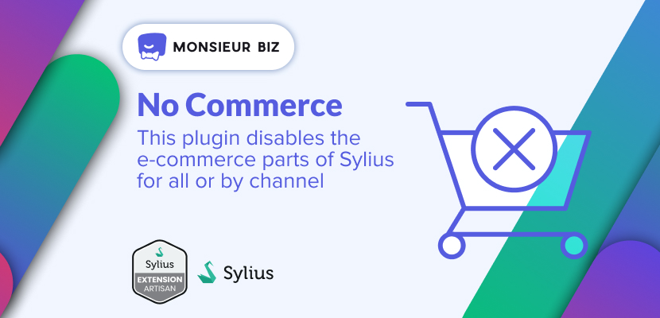

[](https://monsieurbiz.com/agence-web-experte-sylius)

<h1 align="center">No Commerce for Sylius</h1>

[](https://github.com/monsieurbiz/SyliusNoCommercePlugin/blob/master/LICENSE.txt)
[](https://github.com/monsieurbiz/SyliusNoCommercePlugin/actions?query=workflow%3ATests)
[](https://github.com/monsieurbiz/SyliusNoCommercePlugin/actions?query=workflow%3ASecurity)
[](https://github.com/monsieurbiz/SyliusNoCommercePlugin/actions?query=workflow%3ASecurity)

This plugin disables the e-commerce parts of Sylius.  
Basically it disables the routes and updates the admin and frontend templates.


## Compatibility

| Sylius Version | PHP Version     |
|----------------|-----------------|
| 1.12           | 8.1 - 8.2 - 8.3 |
| 1.13           | 8.1 - 8.2 - 8.3 |
| 1.14           | 8.1 - 8.2 - 8.3 |

## Installation

If you want to use our recipes, you can configure your composer.json by running:

```bash
composer config --no-plugins --json extra.symfony.endpoint '["https://api.github.com/repos/monsieurbiz/symfony-recipes/contents/index.json?ref=flex/master","flex://defaults"]'
```

```bash
composer require monsieurbiz/sylius-no-commerce-plugin
```

<details><summary>For the installation without flex, follow these additional steps</summary>
<p>

Change your `config/bundles.php` file to add this line for the plugin declaration:
```php
<?php

return [
    //..
    MonsieurBiz\SyliusNoCommercePlugin\MonsieurBizSyliusNoCommercePlugin::class => ['all' => true],
];
```

Then create the config file in `config/packages/monsieurbiz_sylius_nocommerce_plugin.yaml`:

```yaml
imports:
    - { resource: "@MonsieurBizSyliusNoCommercePlugin/Resources/config/config.yaml" }
```

</p>
</details>

Add some annotations to your `src/Entity/Channel/Channel.php` entity to prevent error during Channel saving:

```diff
  /**
   * @ORM\Entity
   * @ORM\Table(name="sylius_channel")
+  * @ORM\AssociationOverrides({
+  *     @ORM\AssociationOverride(name="baseCurrency",
+  *         joinColumns=@ORM\JoinColumn(
+  *             name="base_currency_id", referencedColumnName="id", nullable=true
+  *         )
+  *     )
+  * })
   */
  #[ORM\Entity]
  #[ORM\Table(name: 'sylius_channel')]
+  #[ORM\AssociationOverrides([
+      new ORM\AssociationOverride(
+          name: 'baseCurrency',
+          joinColumns: new ORM\JoinColumn(name: 'base_currency_id', referencedColumnName: 'id', nullable: true)
+      )]
+  )]
  class Channel extends BaseChannel
```

Use a different trait for your `src/Kernel.php`:

```diff
-     use MicroKernelTrait;
+     use SyliusNoCommerceKernelTrait;
```

(don't forget the `use MonsieurBiz\SyliusNoCommercePlugin\Kernel\SyliusNoCommerceKernelTrait;` statement or course).

Copy the templates we override:

```bash
cp -Rv vendor/monsieurbiz/sylius-no-commerce-plugin/src/Resources/templates/* templates/
```

Create the new migrations, and run them:

```
./bin/console doctrine:migrations:diff
./bin/console doctrine:migrations:migrate
```

## Re-enable features

In the config file `config/packages/monsieurbiz_sylius_nocommerce_plugin.yaml`, add this lines:

```yaml
# ...
monsieurbiz_sylius_nocommerce:
    config:
        allow_countries: false
        allow_customers: false
        allow_zones: false
```

You can allow different sections by changing the parameters to `true`.

## Ignore routes

By default, the disable firewall listener will ignore the following routes for the developer toolbar.

You can ignore additional routes, such as the preview route for error pages, by adding them to the `config/packages/monsieurbiz_sylius_nocommerce_plugin.yaml` file:

```yaml
parameters:
    monsieurbiz_sylius_nocommerce.disable_firewall.ignored_routes:
        - "_preview_error"
```

## Contributing

You can open an issue or a Pull Request if you want! 😘  
Thank you!
